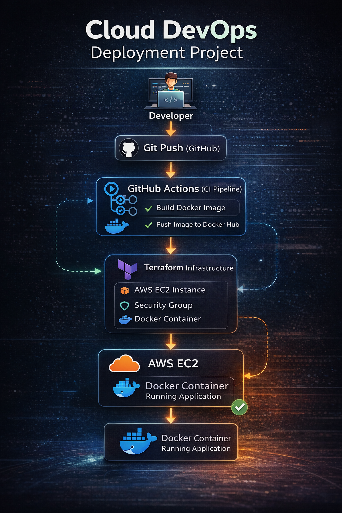

# 📦 Cloud DevOps Deployment Project



## 🚀 Overview

This project demonstrates an **end-to-end DevOps workflow** for deploying a containerized Python application on AWS using Infrastructure as Code and CI/CD automation.

The pipeline automates the entire process from code push to a running application on a cloud server.

---

# 🏗 Architecture

```text
Developer
   ↓
Git Push (GitHub)
   ↓
GitHub Actions (CI Pipeline)
   ↓
Build Docker Image
   ↓
Push Image to Docker Hub
   ↓
Terraform Infrastructure
   ↓
AWS EC2 Instance
   ↓
Docker Container Running Application
```

---

# ⚙️ Technologies Used

* **AWS EC2** – Cloud compute infrastructure
* **Terraform** – Infrastructure as Code (IaC)
* **Docker** – Containerization of the application
* **Docker Hub** – Container image registry
* **GitHub Actions** – CI/CD pipeline automation
* **Python (Flask)** – Sample web application
* **Linux** – Server environment

---

# 📂 Project Structure

```text
cloud-app-deployment
│
├── app
│   └── app.py
│
├── terraform
│   ├── main.tf
│   ├── variables.tf
│   ├── outputs.tf
│   └── terraform.tfvars
│
├── Dockerfile
├── requirements.txt
└── .github
    └── workflows
        └── docker-build.yml
```

---

# 🐳 Docker Container

The application is containerized using Docker.

Build locally:

```bash
docker build -t cloud-app .
```

Run locally:

```bash
docker run -p 5000:5000 cloud-app
```

---

# ☁️ Terraform Infrastructure

Terraform automatically provisions:

* AWS EC2 instance
* Security group configuration
* Docker installation
* Application container deployment

Deploy infrastructure:

```bash
terraform init
terraform apply
```

Destroy infrastructure:

```bash
terraform destroy
```

---

# 🔁 CI/CD Pipeline

GitHub Actions automatically:

1. Builds the Docker image
2. Pushes the image to Docker Hub
3. Prepares the image for deployment

Triggered on every push to the **main branch**.

Workflow file:

```text
.github/workflows/docker-build.yml
```

---

# 🧪 Application

The Flask application returns:

```
Hello from AWS Terraform Project 🚀
```

Once deployed, the app becomes accessible through the **EC2 public IP**.

---

# 🧠 Key Learnings

Through this project I learned:

* Containerizing applications with Docker
* Building automated CI pipelines using GitHub Actions
* Deploying infrastructure using Terraform
* Debugging cloud-init and Docker issues
* Automating application deployment on AWS

---

# 🎯 Future Improvements

* Add monitoring with CloudWatch
* Use load balancer and auto-scaling
* Implement blue/green deployments
* Add automated infrastructure testing

---

# 👨‍💻 Author

Built as part of my **Cloud / DevOps learning journey**.

---

# ⭐ If You Found This Useful

Feel free to **star the repository**.